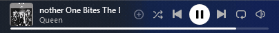

# Taskbar Widget for Spotify

A now-playing widget embedded right into the Windows 11 taskbar: album art,
title and artist of the current Spotify track, with full controls — play/pause,
skips, favorites with liked state, all three shuffle modes, repeat, volume and
a seekable progress bar.

> **Disclaimer:** independent project, **not affiliated with, sponsored or
> endorsed by Spotify AB**. "Spotify" is a trademark of Spotify AB.



## Install

- **Microsoft Store (recommended):**
  [**Taskbar Widget for Spotify**](https://apps.microsoft.com/detail/9P12TLJZG2CJ) —
  one-click install, automatic updates, and works with Smart App Control enabled.
- **Direct download:** grab **`SpotifyTaskbarWidget-Setup.exe`** from the
  [latest release](https://github.com/mechanicwb2-hub/spotify-taskbar-widget/releases/latest)
  and run it — per-user install (no admin rights), installs the .NET 8 Desktop
  Runtime automatically if missing, and self-updates from GitHub Releases.
- **winget** (pending review): `winget install MechanicWB.TaskbarWidgetForSpotify`
- Requires Windows 11 and the Spotify desktop app.
- UI languages: English and Portuguese (follows your Windows language).

## How it works

- Track data comes from the **Windows media session API (SMTC)** — the same one
  behind the Windows volume flyout. The Spotify desktop app publishes the
  current track there, so **no Spotify login or API keys are needed**.
- The Windows 11 taskbar no longer supports "deskbands", so the widget is a
  borderless always-visible window docked over the empty area of the taskbar.
- **Automatic positioning:** using UI Automation, the widget finds the
  weather/widgets button and aligns right after it; with Windows widgets
  disabled it aligns to the left edge, and with left-aligned taskbar icons it
  docks on the right, before the system tray. It never overlaps the centered
  icons — on small screens the text column shrinks and less important buttons
  hide themselves. Works on any resolution/DPI and follows taskbar auto-hide.
- Hides automatically when an app is fullscreen (games, videos).

## Usage

- **Position:** locked and automatic by default. To move it: right-click →
  *Move widget*, drag, and untick to lock it in the new spot. *Reset to
  automatic position* brings back auto alignment.
- **Multiple monitors:** right-click → *Monitor* and tick every taskbar you
  want a widget on — each display gets its own, with shared settings. (Needs
  Windows' "show my taskbar on all displays" enabled for secondary monitors.)
- **Size:** right-click → *Size* → Small / Normal / Large.
- **Brightness:** right-click → *Brightness* — a slider from 20% to 100%, handy
  to dim the widget on OLED or transparent taskbars. Scroll the mouse wheel
  over it to fine-tune.
- **Buttons:** right-click → *Buttons* to choose which controls appear —
  play/pause, favorites (+), shuffle, previous, next, repeat, volume. Hide
  play/pause to use it as a pure now-playing display.
- **Long titles:** scroll continuously by default; right-click → *Scroll title
  only once* to have them scroll once at the start of each track and then rest.
- **Favorites (+):** reads and clicks Spotify's own button through the Spotify
  window's accessibility tree — shows a **green check** when the track is
  already saved, and adds it without stealing focus. Note: Spotify freezes this
  info while its window is minimized (and has locked the Web API alternative),
  so the widget shows the green check only when it can actually confirm it —
  otherwise it stays neutral rather than guessing. Adding with **+** always
  works. See [TROUBLESHOOTING.md](TROUBLESHOOTING.md) for the full explanation.
- **Shuffle:** all three Spotify modes — off (gray), shuffle (green) and
  **Smart Shuffle** (green with a star). Clicking cycles through them just like
  in Spotify. Repeat also supports all three modes (off / playlist / track).
- **Volume:** moves Spotify's own volume slider (its UI follows along).
- **Progress bar:** live position at the bottom of the widget; click to seek.
- **Click** the art/text to open the Spotify window.
- Settings and error log live in `%APPDATA%\SpotifyTaskbarWidget\`.

## Look

Faithful to Spotify's theme: the official vector icons (SVG paths from the web
player), #1ED760 green for active states, #B3B3B3 gray for inactive ones, the
green dot under active shuffle, the star for Smart Shuffle, hover scaling and
a horizontal volume slider with green fill and white thumb. Adapts to light
and dark Windows taskbar themes.

## Updates

- Menu → **Check for updates** (it also checks quietly at startup and
  highlights the menu item when a new version exists). Updating downloads the
  new exe from GitHub Releases, replaces itself and restarts.
- Publishing an update (maintainers):
  1. bump the version in `.csproj` (`<Version>`) and `setup.iss` (`MyAppVersion`);
  2. `dotnet publish SpotifyTaskbarWidget.csproj -c Release -o publish`;
  3. `ISCC.exe setup.iss` to produce `installer\SpotifyTaskbarWidget-Setup.exe`;
  4. create the GitHub release with tag `vX.Y.Z`, attaching **both**
     `publish\SpotifyTaskbarWidget.exe` (auto-update) and
     `installer\SpotifyTaskbarWidget-Setup.exe` (new users).
     **Never rename these assets** — the auto-updater matches
     `SpotifyTaskbarWidget.exe` by exact name (GitHub sorts assets
     alphabetically, so "first .exe" heuristics are unsafe);
  5. update the SHA256 in the winget manifest (`winget\…installer.yaml`).

## Resilience

If a Spotify update ever breaks the accessibility integration (liked state,
Smart Shuffle, internal volume), the widget degrades gracefully to SMTC —
play/pause, track info and art keep working — and the heuristics in
`SpotifyUiaService.cs` can be fixed and shipped through the auto-updater.

## Troubleshooting

Something not working? See **[TROUBLESHOOTING.md](TROUBLESHOOTING.md)** —
covers "nothing playing", antivirus flags, Smart App Control, positioning
and more. Still stuck?
[Open an issue](https://github.com/mechanicwb2-hub/spotify-taskbar-widget/issues).

## Support

The widget is free and open source. If you find it useful, you can support
development on **[Ko-fi](https://ko-fi.com/mechanicwb2)** ☕

## Building

Requires the .NET 8 SDK:

```
dotnet publish SpotifyTaskbarWidget.csproj -c Release -o publish
```

Produces a single `SpotifyTaskbarWidget.exe` (needs the .NET 8 Desktop
Runtime; for a standalone exe, flip `SelfContained` to `true`).

## Structure

| File | Role |
|---|---|
| `MainWindow.xaml(.cs)` | Widget UI, positioning, responsive layout, menu |
| `MediaService.cs` | Windows media API (track, art, play/pause, timeline) |
| `TaskbarAnchors.cs` | UI Automation: widgets-button and Start-button anchors |
| `SpotifyUiaService.cs` | Spotify window accessibility: favorites, shuffle modes, repeat, volume |
| `SpotifyVolume.cs` | CoreAudio (fallback): app volume via the Windows mixer |
| `SpotifyActions.cs` | Fallbacks: real-click favorites; opening the Spotify window |
| `Interop.cs` | Win32 (taskbar position, topmost, fullscreen detection, input) |
| `WidgetSettings.cs` | Position, scale and visible buttons, stored as JSON |
